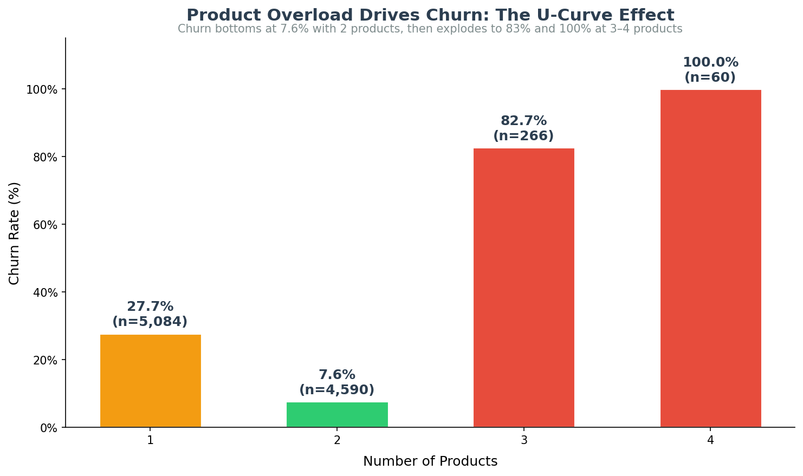
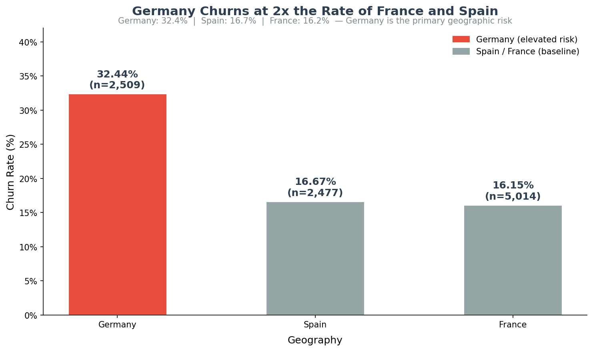
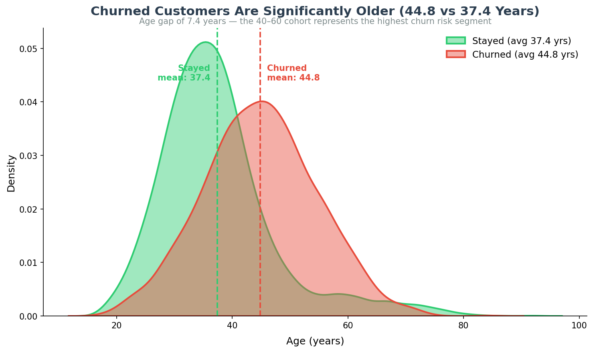
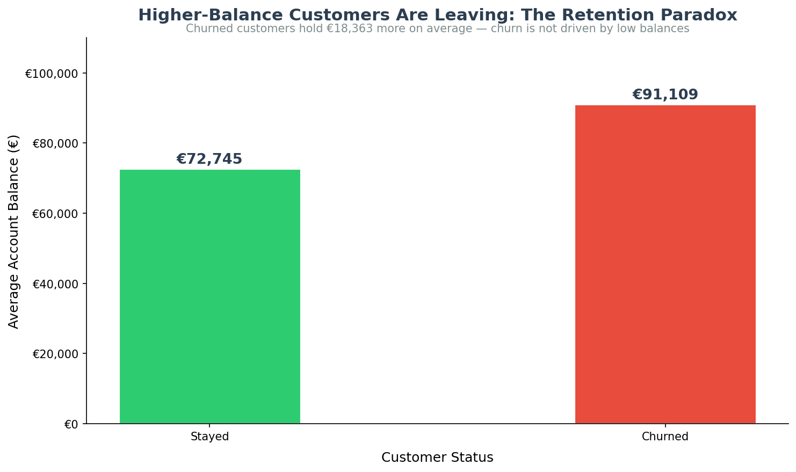

# Customer Churn Analysis

Exploratory data analysis on 10,000 bank customers to identify why customers leave — uncovering a balance paradox, a geographic anomaly, and a product bundling trap that retention teams can act on directly.

## Live Dashboard

🔗 **Interactive Dashboard:** https://customer-churn-dashboard-delta.vercel.app

Built with Next.js + Recharts + shadcn/ui + papaparse (10,000 rows, client-side CSV parsing).

## Key Findings

1. **Balance Paradox:** Churned customers held a higher average balance (€91,109) vs. retained customers (€72,745) — the bank's most valuable customers are leaving, not its struggling ones.
2. **Germany Anomaly:** Germany churn rate is 32.44% — more than double France (16.2%) and Spain (16.7%) — despite representing 25% of the customer base.
3. **Age Gap:** Churned customers average 44.8 years old vs. 37.4 for retained customers — the 40–60 cohort is the highest-risk segment.
4. **Product U-Curve:** 1–2 products: low churn (7.6% at 2 products); 3 products: 82.7% churn; 4 products: 100% churn — bundling is a churn accelerant, not a loyalty driver.

## Dataset

| Field | Detail |
|-------|--------|
| Source | [Kaggle — Churn Modelling Dataset](https://www.kaggle.com/datasets/shrutimechlearn/churn-modelling) |
| Rows | 10,000 customers |
| Columns | 14 (credit score, geography, age, balance, products, activity status, etc.) |

## Tech Stack

- **Analysis:** Python (pandas, matplotlib, seaborn, sqlite3)
- **Database:** SQLite (`churn.db` — gitignored, rebuilt by CI from CSV)
- **Dashboard:** Next.js + Recharts + shadcn/ui + papaparse
- **Deployment:** Vercel (dashboard), GitHub Actions (CI)
- **CI:** 2-job workflow — Python reproducibility + Next.js build

## Project Structure

```
customer-churn-analysis/
├── eda_visualizations.py   # Full EDA script — generates all 4 charts
├── churn_data.csv          # Cleaned dataset (677KB, 10,000 rows)
├── outputs/                # 4 PNG EDA visualizations
├── dashboard/              # Next.js dashboard source (deployed to Vercel)
└── .github/workflows/      # CI — Python + Next.js build checks
```

## Visualizations









## How to Run

1. Clone the repo: `git clone https://github.com/Ausmin787/customer-churn-analysis`
2. Install dependencies: `pip install pandas matplotlib seaborn`
3. Run: `python eda_visualizations.py`
4. Charts saved to `outputs/`

## Author

Data Analyst Portfolio Project | https://github.com/Ausmin787/customer-churn-analysis
