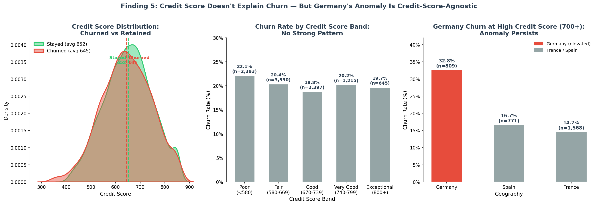
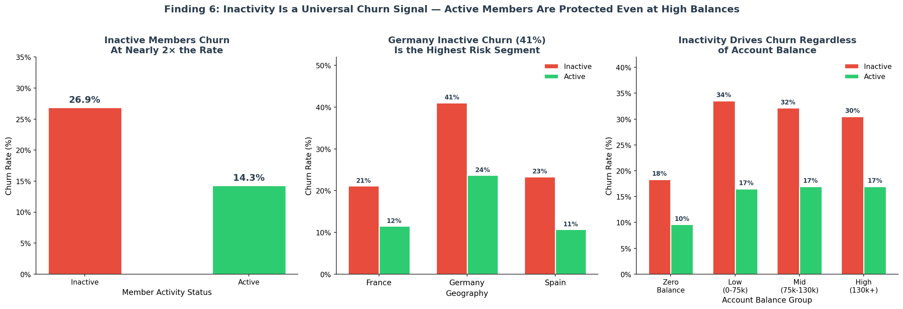
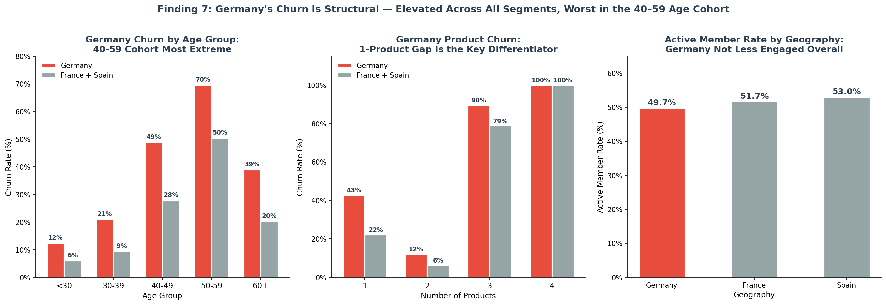
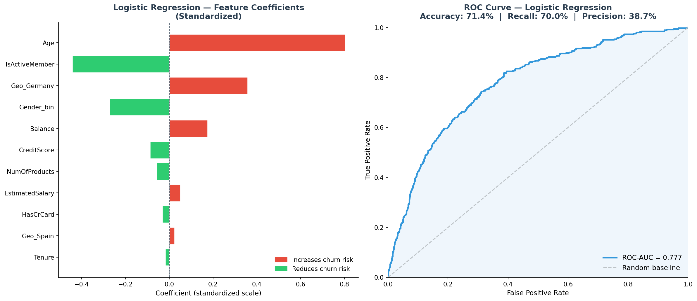
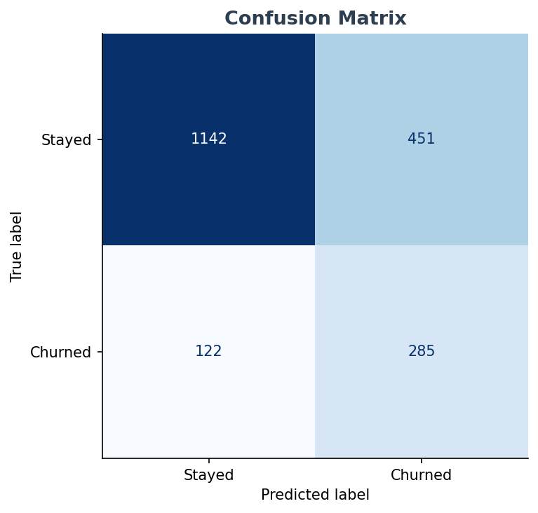

# Customer Churn Analysis

Exploratory data analysis on 10,000 bank customers to identify why customers leave — uncovering a balance paradox, a geographic anomaly, and a product bundling trap that retention teams can act on directly. Includes a logistic regression churn prediction model.

## Live Dashboard

🔗 **Interactive Dashboard:** https://customer-churn-dashboard-delta.vercel.app

Built with Next.js + Recharts + shadcn/ui + papaparse (10,000 rows, client-side CSV parsing).

## Key Findings

1. **Balance Paradox:** Churned customers held a higher average balance (€91,109) vs. retained customers (€72,745) — the bank's most valuable customers are leaving, not its struggling ones.
2. **Germany Anomaly:** Germany churn rate is 32.44% — more than double France (16.2%) and Spain (16.7%) — despite representing 25% of the customer base.
3. **Age Gap:** Churned customers average 44.8 years old vs. 37.4 for retained customers — the 40–60 cohort is the highest-risk segment.
4. **Product U-Curve:** 1–2 products: low churn (7.6% at 2 products); 3 products: 82.7% churn; 4 products: 100% churn — bundling is a churn accelerant, not a loyalty driver.
5. **Credit Score Paradox:** Churn rates are nearly uniform across all credit score bands (18–22%) — creditworthiness does not protect against churn. Germany's 32–33% churn persists even among customers with credit scores above 700, confirming the anomaly is structural, not credit-driven.
6. **Activity Gap:** Inactive members churn at 26.9% vs. 14.3% for active members — nearly 2× the rate. Germany's inactive segment hits 41.1%, the single highest-risk cohort in the dataset. Critically, inactivity drives churn across all balance groups — high-balance inactive customers churn as much as low-balance inactive ones.
7. **Germany Deep Dive:** Germany's elevated churn is not concentrated in one segment — it is structural. The 40–49 cohort churns at 48.8% in Germany vs. 27.8% elsewhere; the 50–59 cohort reaches 69.6%. Germany's 1-product holders churn at 42.9% vs. 22.3% in France/Spain. Active member rates are similar across all three countries, ruling out engagement as the root cause.

## Germany Analysis

| Segment | Germany Churn | France + Spain Churn |
|---------|--------------|----------------------|
| Age 30–39 | 20.9% | 9.5% |
| Age 40–49 | 48.8% | 27.8% |
| Age 50–59 | 69.6% | 50.4% |
| 1 Product | 42.9% | 22.3% |
| 2 Products | 12.1% | 6.3% |
| Active rate | 49.7% | 51.7–53.0% |

Germany's churn is elevated at every age group and product tier. The anomaly is structural — likely driven by local competition, pricing, or service quality — not by customer demographics or engagement levels.

## Prediction Model

Logistic regression trained on all 11 features (encoded Geography + Gender, `class_weight="balanced"` for imbalanced target).

| Metric | Score |
|--------|-------|
| ROC-AUC | 0.777 |
| Recall | 70.0% |
| Precision | 38.7% |
| Accuracy | 71.4% |

Top predictors by coefficient magnitude: **Age**, **IsActiveMember**, **Balance**, **NumOfProducts**, and **Geo_Germany** all rank as significant. Age and Germany geography increase churn risk most strongly; being an active member is the top protective factor.

## Dataset

| Field | Detail |
|-------|--------|
| Source | [Kaggle — Churn Modelling Dataset](https://www.kaggle.com/datasets/shrutimechlearn/churn-modelling) |
| Rows | 10,000 customers |
| Columns | 14 (credit score, geography, age, balance, products, activity status, etc.) |

## Tech Stack

- **Analysis:** Python (pandas, matplotlib, seaborn, scikit-learn)
- **Database:** SQLite (`churn.db` — gitignored, rebuilt by CI from CSV)
- **Dashboard:** Next.js + Recharts + shadcn/ui + papaparse
- **Deployment:** Vercel (dashboard), GitHub Actions (CI)
- **CI:** 2-job workflow — Python reproducibility + Next.js build

## Project Structure

```
customer-churn-analysis/
├── eda_visualizations.py         # Findings 1–4 (products, geography, age, balance)
├── finding5_credit_score.py      # Finding 5: credit score distribution + Germany cross-tab
├── finding6_active_member.py     # Finding 6: active vs inactive churn by geo + balance
├── finding7_germany_deepdive.py  # Finding 7: Germany segmented by age + products
├── model_logistic_regression.py  # Logistic regression model — ROC curve + feature coefficients + confusion matrix
├── churn_data.csv                # Cleaned dataset (677KB, 10,000 rows)
├── outputs/                      # 9 PNG visualizations
├── dashboard/                    # Next.js dashboard source (deployed to Vercel)
└── .github/workflows/            # CI — Python + Next.js build checks
```

## Visualizations












## How to Run

1. Clone the repo: `git clone https://github.com/Ausmin787/customer-churn-analysis`
2. Install dependencies: `pip install pandas matplotlib seaborn scikit-learn`
3. Run EDA: `python eda_visualizations.py`
4. Run extended findings:
   ```bash
   python finding5_credit_score.py
   python finding6_active_member.py
   python finding7_germany_deepdive.py
   python model_logistic_regression.py
   ```
5. Charts saved to `outputs/`

## Author

Data Analyst Portfolio Project | https://github.com/Ausmin787/customer-churn-analysis
